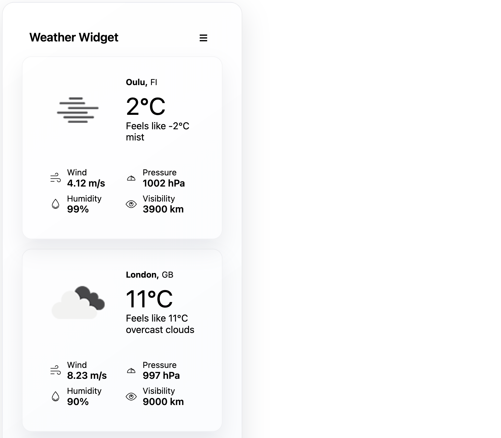
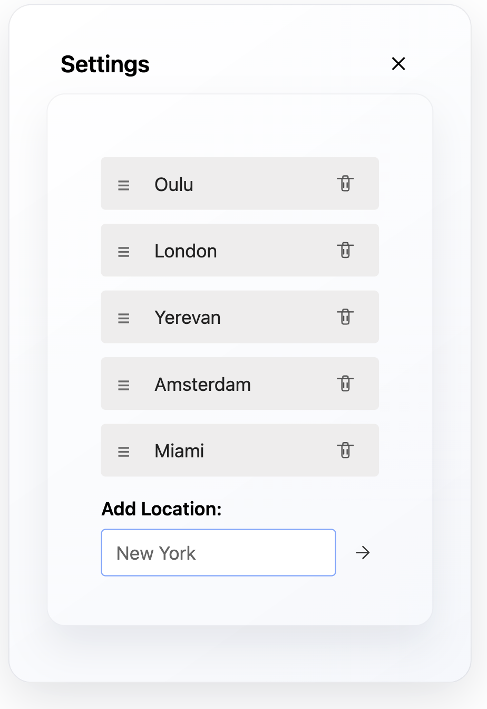

# Vue 3 + TypeScript + Vite

This template should help get you started developing with Vue 3 and TypeScript in Vite. The template uses Vue 3 `<script setup>` SFCs, check out the [script setup docs](https://v3.vuejs.org/api/sfc-script-setup.html#sfc-script-setup) to learn more.

Learn more about the recommended Project Setup and IDE Support in the [Vue Docs TypeScript Guide](https://vuejs.org/guide/typescript/overview.html#project-setup).


## Embedding the widget (single script)

You can build an embeddable single-file bundle that registers a `<weather-widget>` custom element. The bundle is emitted to `dist/weather-widget.js` by the Vite embed build.

Build the embeddable bundle:

```bash
npm install
npm run build:embed
```

Then include the generated script on any page and use the custom element tag. Example:

```html
<!doctype html>
<html>
	<head>
		<meta charset="utf-8" />
		<title>Embed Weather Widget</title>
	</head>
	<body>
		<!-- include the generated bundle (adjust path as needed) -->
		<script src="/dist/weather-widget.js"></script>

		<!-- drop the widget tag anywhere in your page -->
		<weather-widget></weather-widget>
	</body>
</html>
```

Notes:
- The embed bundle registers the `weather-widget` custom element on load. It mounts the Vue component into a shadow root for encapsulation.
- For production use, make sure to move your OpenWeather API key to a server-side proxy or environment variables. See `TASKS.md` for recommended next steps.